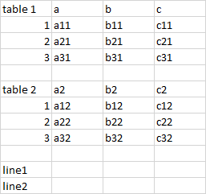
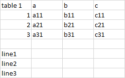
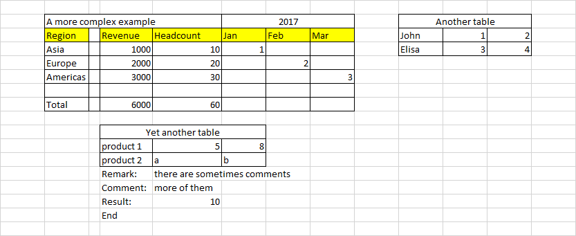
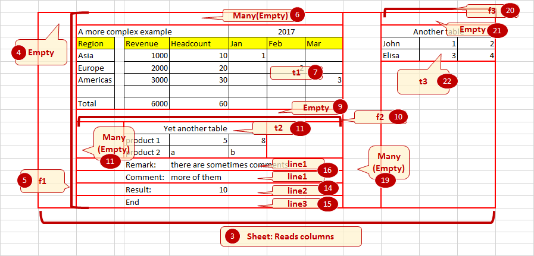

Introduction to sheetparser
***************************

The purpose of this library is to simplify complex Excel sheets
reading. The idea is to describe the layout of the sheet with spatial
patterns, allowing for changes in actual position of the elements.

    
    sheet 1: Example of tables inside a sheett

For instance, let's assume that we need to extract data from sheet 1
on the right. That sheet could be described as:

 *	One table with top and left header
 *	Followed by and empty line
 *	Another table with top and left header
 *	An empty line
 *	And 2 lines

We code the pattern as follows:

.. code-block:: python
   
    from sheetparser import *

    pattern = Sheet('sheet', Rows,
                    Table, 
                    Empty,
                    Table,
                    Empty,
                    Line, Line)

This pattern will recognize all sheets with a similar layout. The
tables could be smaller or larger. The argument `Rows` is for the
layout of the sheet: it would be `Columns` if the tables were aligned
horizontally.

The pattern is used as follows:

.. code-block:: python

    wbk = load_workbook('test_table1.xlsx',with_formatting=False)
    context = ListContext()
    pattern.match_range(wbk['Sheet2'], context)
    print(context.root)

We first open the workbook, and create a context. This object will
store the parsing result. There are 2 provided context classes:
`PythonObjectResult` will contain results in a hierarchy that replicates
the hierarchy of patterns, and ListResult will return them as a list
of values.

The next step is to check if the pattern matches the sheet. It will
raise a DoesntMatchException if not. The final step to read the result
from context.root.

The result is available in context. If we print it, we obtain the following value

.. code-block:: python

    {'table': [Table table ([['a11', 'b11', 'c11'], ['a21', 'b21', 'c21'],
    ['a31', 'b31', 'c31']]), Table table ([['a12', 'b12', 'c12'], ['a22',
    'b22', 'c22'], ['a32', 'b32', 'c32']])], 'line': [['line1'],
    ['line2']], '__meta': [{'name': 'Sheet2'}]}

This represents the result of the parsing, and can be easily used in a
program, for instance to load in a database.

    
    sheet 2: Version 2 of the sheet

Now let'ss assume that the accounting department issues one month
later an updated version of this document (version 2), but there is
now only 1 table and 3 lines. We can add a little more flexibility in
our pattern:

.. code-block:: python

    pattern = Sheet('sheet', Rows,
                Many(Table, Empty, min=1,max=2),
                Many(Line)
                )

With that pattern, we can match both sheets.
Alternatively, we could code this:

.. code-block:: python

    pattern = Sheet('sheet', Rows,
                Table, Empty,
                Maybe(Table, Empty),
                Many(Line)
                )

The idea is similar to regular expressions. It provides a powerful
language to accommodate different situations, and with a flexible
system to detect sheet features such as text or formatting.

Another example
---------------

Here's a more complex example:

.. code-block:: python
    :linenos:

        wbk = load_workbook(filename, with_formatting=True)
        sheet = wbk['Sheet6']
        pattern = Sheet('sheet', Columns,
                        Many(Empty),
                        FlexibleRange('f1',Rows,
                                      Many(Empty),
                                      Table('t1',[GetValue, HeaderTableTransform(2,1),FillData,RemoveEmptyLines('columns')],
                                            stop=no_horizontal), 
                                      Empty, 
                                      FlexibleRange('f2',Columns,
                                                    Many(Empty),Table('t2'),
                                                    stop=no_horizontal),
                                      Many(Empty),
                                      Many((Line('line2',[get_value,Match('Result:')]) 
                                            + Line('line3',[StripLine(),get_value]))
                                           | Line('line1')),
                                      stop = lambda line,linecount: linecount>2 and empty_line(line)
                                      ),
                        Many(Empty),
                        FlexibleRange('f3',Rows,
                                      Many(Empty),
                                      Table('t3',stop = no_horizontal)))

Here's how it works (the numers refer to the line number in the code above):

